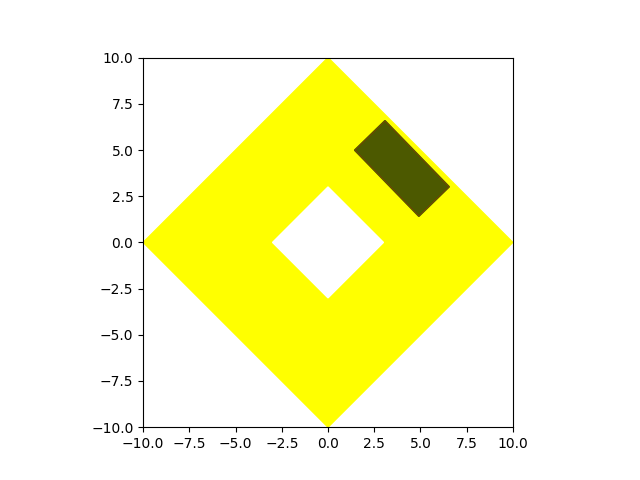

# Polygon Fill Test

## Contents

- [Problem Description](#problem-description)
    - [Given](#given)
    - [Action](#action)
    - [Goal](#goal)
    - [Constraints](#constraints)
    - [Allowed](#allowed)
    - [Restricted](#restricted)
    - [Recommended](#recommended)
- [Manual](#manual)
    - [Installation](#installation)
    - [Import and Create Instance](#import-and-create-instance)
    - [Properties](#properties)
    - [Methods](#methods)
    - [Examples](#examples)
- [Submission Guidelines](#submission-guidelines)
    - [Submission Deadline](#submission-deadline)
    - [Submission List](#submission-list)
    - [How to Submit](#how-to-submit)
- [Appendix](#appendix)
    - [Wrapper Environment Sample (Wrapper environment for raster information)](#wrapper-environment-sample-(wrapper-environment-for-raster-information))
    - [Figures](#figures)

## Problem Description

Spacewalk is a company that discovers the value of space.  
In order to discover the value of space, it's important to make a plan for space.  
There two method to make a plan for space, division and filling.  
  
For parking lot planning, filling is suitable method.  
You will solve the simplified version of paking lot planning.  
(with no legal constraints!)  

Suppose there are a piece of land, and we are planning to make a parking lot.  
In order to maximize the value of the land, it's crucial to make a parking layout of maximum number of parking spaces.  

The optimal parking layout depends on the condition of the land, especially the shape of the land.

We will give you predefined "space"(corresponds to land) and "patch"(corresponds to parking space).  
Your task is to fill the space with maximum number of patches.  
To fill the space, you can rotate and translate patches.  
A patch have to be placed within the space, and cannot overlap other patches.

### Given

- Set of space to fill
    - 10 predefined spaces are given
    - Array of polygon vertex coordinates
- Patch to place
    - Single unit patch of which the centroid is on origin and zero rotation is given
    - Array of polygon vertex coordinates
- State information
    - When action is applied, information of subsequent state is calculated and offered

### Action

- Patch placement with rotation and translation parameter

### Goal

- Fill the target spaces with maximum number of patches
    - Target spaces are given predefined spaces (There are 10 predefined spaces)
- The number of trial have to be minimized at inference time
    - When an action is applied, trial count gains by 1, regardless of the action validity
    - When the action is invalid, environment fails to place the patch, and patch won't be placed but trial number will be counted

### Constraints

- Patch have to be placed within the space
- Patch cannot overlap other patches

### Allowed

- You can wrap the given environment with your custom environment
    - Given environment provides minimal information to solve the problem
    - Depends on your method, these information may not sufficient to solve the problem
    - You can create a wrapper environment to generate additional information
    - If you are familiar with some frameworks(like Gym, etc.), you can use given environment as a library and create wrapper environment inherits framework you want to use
    - If you create a wrapper environment, you have to submit that as well

### Restricted

- You have to solve the problem with just one generalized agent
    - Using different agents for different spaces is prohibited

### Recommended

- Generalized agent is recommended
    - There are additional test spaces that we do not offer to applicants
    - Good performance on those is not mandatory, but recommended
    - Extra points will given for performance on those test set

- Minimal rule is recommended
    - To make better performance, simplifying problem with adding some rules is effective way
    - But, the more we add rules, versatility of the agent decreases and not adaptable to complex problem
    - The real problem is much more complex than this toy problem, that we have to minimize rules for agent
    - Don't hesitate to add rules if you think they are essential to solve the problem, but avoid adding unnecessary rules

## Manual

### Installation

First, you have to install `spwkml` package.

If you have access to Spacewalk ML Test repository, you can install it with :
```console
pip install git+https://github.com/TeamSPWK/spwk-ml-test.git
```

If not, the package should have been delivered to you via email.
Then, you can install it with :
```console
python setup.py install
```

### Import and Create Instance

`spwkml` package offers environment class for problem definition above.  
You can make environment instance with it.

```python
from spwkml import PolygonFillEnv

env = PolygonFillEnv()
```

`PolygonFillEnv` class has several properties and methods.

### Properties

`env.spaces`

- Space samples to place patches
- It consists of several spaces
- Canvas bound is `(-10, -10, 10, 10)`, and you don't have to consider space out of bound
- You can select space among these spaces with env.select_space() method

`env.space`

- Dictionary of two items
    - shell : coordinate array of polygon shell
    - holes : list containing coordinate array of polygon hole
- Shell will form outer wall, and holes will form inner wall of space polygon
```python
{
    'shell': array([[-10., -10.],
                    [-10.,  10.],
                    [ 10.,  10.],
                    [ 10., -10.],
                    [-10., -10.]]), 
    'holes': [
        array([[-5., -5.],
                [ 5., -5.],
                [ 5.,  5.],
                [-5.,  5.],
                [-5., -5.]])
    ]
}
```
[See Figure 1 : Space with (-10, -10 ,10 ,10) bound box shell and (-5, -5, 5, 5) bound box hole](#fig1)

`env.patch`

- Coordinate array of base patch to fill space
- Its centroid is on `(0, 0)`
- The action will be placing the patch, rotated and translated from this base patch
- Fixed value (Just one type of base patch is considered)
    - `[[-2.5, -1.15], [2.5, -1.15], [2.5, 1.15], [-2.5, 1.15], [-2.5, -1.15]]`

[See Figure 2 : Base patch](#fig2)

`env.new_patch`

- Coordinate array of latest patch applied by action
- It's updated regardless of action validity
    - When the action is invalid and the patch is not placed, `env.new_patch` will be updated though

`env.placed_patches`

- List containing coordinate array of placed patches
- Its sequence correspond to `env.step` sequence
- Invalid patch won't shown on this property

`env.n_patches`

- Number of patches placed on the space
- It counts valid patches only

`env.n_steps`

- Number of trial to place the patch on the space
- Every patch placement increments this property, whether valid or invalid

### Methods

`env.select_space(index)`

- Select the space from predefined spaces with index
    - It select the space from `env.spaces`
- It resets the environment
    - Placed patches is removed
    - `env.n_steps` counter is reset

`env.step(patch_x, patch_y, patch_angle)`

- Apply action
    - args
        - `patch_x (float)` : The centroid x position of patch. The range is -10 to 10
        - `patch_y (float)` : The centroid y position of patch. The range is -10 to 10
        - `patch_angle (float)` : The rotation of patch. The range is -pi/2 to pi/2. (unit:radian)
    - returns
        - `(dict)` : Next state information
            - `is_valid (bool)` : If applied action is valid or not
            `area_out_of_space` and `area_intersect_patches`, either one of the is non-zero, the action is invalid
            - `n_steps` : `env.n_steps` updated by the action
            - `n_patches` : `env.n_patches` updated by the action
            - `space` : `env.space` updated by the action
            - `selected_patch` : `env.new_patch` updated by the action
            - `placed_patches` : `env.placed_patches` updated by the action
            - `area_out_of_space` : The area where the patch is out of space
            - `area_intersect_patches` : The area where a patch overlaps other patches


`env.reset()`

- Reset environment
    - Remove all placed patches
    - Set step counter to zero

`env.render(save_img=False, path=None, fname=None, show_last=True, show_axis=True)`

- Render current state. With adjusting its args, you can use image feature for training.
    - args
        - `save_img (bool)` : Whether or not save the image as file.
        - `path (str)` : Path to save image. If `save_img` is False, it's meaningless. Default path is `./imgs` (when `path` is None).
        - `fname (str)` : File name to save image. If save_img is False, it's meaningless. Default name is `img_i.png`, and `i` is growing integer (when `fname` is None).
        - `show_last (bool)` : Whether or not color the last patch. If true, last patch is colored by translucent red.
        - `show_axis (bool` : Whether or not plot the axis.

### Examples

With the code below, you can check how the environment works  

First, with `env.spaces` property, you can get information of predefined spaces.  
There are 10 predefined spaces.  

```python
print(env.spaces)

[
    {
        'shell': array([[-10., -10.],
                        [ 10., -10.],
                        [ 10.,  10.],
                        [-10.,  10.],
                        [-10., -10.]]), 
        'holes': []
    }, 
    {
        'shell': array([[-10., -10.],
                        [ -3., -10.],
                        [ -3.,  10.],
                        [-10.,  10.],
                        [-10., -10.]]), 
        'holes': []
    }, 
    {
        'shell': array([[-5., -5.],
                        [ 5., -5.],
                        [ 5.,  5.],
                        [-5.,  5.],
                        [-5., -5.]]), 
        'holes': []
    }, 
    {
        'shell': array([[-10., -10.],
                        [-10.,  10.],
                        [ 10.,  10.],
                        [ 10., -10.],
                        [-10., -10.]]), 
        'holes': [
            array([[-5., -5.],
                    [ 5., -5.],
                    [ 5.,  5.],
                    [-5.,  5.],
                    [-5., -5.]])
        ]
    }, 
    {
        'shell': array([[  0., -10.],
                        [ 10.,   0.],
                        [  0.,  10.],
                        [-10.,   0.],
                        [  0., -10.]]), 
        'holes': []
    }, 
    {
        'shell': array([[  0., -10.],
                        [-10.,   0.],
                        [  0.,  10.],
                        [ 10.,   0.],
                        [  0., -10.]]), 
        'holes': [
            array([[ 0., -3.],
                    [ 3.,  0.],
                    [ 0.,  3.],
                    [-3.,  0.],
                    [ 0., -3.]])
        ]
    }, 
    {
        'shell': array([[-10., -10.],
                        [ 10., -10.],
                        [ 10.,  -6.],
                        [ -2.,  -6.],
                        [ -2.,   6.],
                        [ 10.,   6.],
                        [ 10.,  10.],
                        [-10.,  10.],
                        [-10., -10.]]), 
        'holes': []
    }, 
    {
        'shell': array([[-10., -10.],
                        [  8., -10.],
                        [ 10.,   7.],
                        [-10.,  10.],
                        [  0.,  -3.],
                        [-10., -10.]]), 
        'holes': []
    }, 
    {
        'shell': array([[-10., -10.],
                        [ 10., -10.],
                        [  0.,  10.],
                        [-10., -10.]]), 
        'holes': []
    }, 
    {
        'shell': array([[-10., -10.],
                        [  0.,  10.],
                        [ 10., -10.],
                        [-10., -10.]]), 
       'holes': [
            array([[-4., -6.],
                    [ 4., -4.],
                    [-2.,  2.],
                    [-4., -6.]])
        ]
    }
]
```

One of predefined spaces is selected as current space, and you can get this by `env.space` property.  
As default, first space (space of index 0) is selected as current space.  
```python
print(env.space)

{
    'shell': array([[-10., -10.],
                    [ 10., -10.],
                    [ 10.,  10.],
                    [-10.,  10.],
                    [-10., -10.]]), 
    'holes': []
}
```

You can get fixed patch information with `env.patch` property.  
This is unit patch, and when you apply action, this patch will be rotated, and translated.
```python
print(env.patch)

array([[-2.5 , -1.15],
       [ 2.5 , -1.15],
       [ 2.5 ,  1.15],
       [-2.5 ,  1.15],
       [-2.5 , -1.15]])
```

In order to know the shape of predefined spaces, you can use `env.select_space(index)` method and `env.render` method.  
There are 10 predefined spaces, so you can use index 0~9 without adding other spaces.
```python
for i in range(len(env.spaces)):
    env.select_space(i)
    print(env.space)
    env.render()
```

```python
{
    'shell': array([[-10., -10.],
                    [ 10., -10.],
                    [ 10.,  10.],
                    [-10.,  10.],
                    [-10., -10.]]), 
    'holes': []
}
```

[See Figure 3 : Space 0](#fig3)

```python
{
    'shell': array([[-10., -10.],
                    [ -3., -10.],
                    [ -3.,  10.],
                    [-10.,  10.],
                    [-10., -10.]]), 
    'holes': []
}
```

[See Figure 4 : Space 1](#fig4)

```python
{
    'shell': array([[-5., -5.],
                    [ 5., -5.],
                    [ 5.,  5.],
                    [-5.,  5.],
                    [-5., -5.]]), 
    'holes': []
}
```

[See Figure 5 : Space 2](#fig5)

```python
{
    'shell': array([[-10., -10.],
                    [-10.,  10.],
                    [ 10.,  10.],
                    [ 10., -10.],
                    [-10., -10.]]), 
    'holes': [
        array([[-5., -5.],
                [ 5., -5.],
                [ 5.,  5.],
                [-5.,  5.],
                [-5., -5.]])
    ]
}
```

[See Figure 6 : Space 3](#fig6)

```python
{
    'shell': array([[  0., -10.],
                    [ 10.,   0.],
                    [  0.,  10.],
                    [-10.,   0.],
                    [  0., -10.]]), 
    'holes': []
}
```

[See Figure 7 : Space 4](#fig7)

```python
{
    'shell': array([[  0., -10.],
                    [-10.,   0.],
                    [  0.,  10.],
                    [ 10.,   0.],
                    [  0., -10.]]), 
    'holes': [
        array([[ 0., -3.],
                [ 3.,  0.],
                [ 0.,  3.],
                [-3.,  0.],
                [ 0., -3.]])
    ]
}
```

[See Figure 8 : Space 5](#fig8)

```python
{
    'shell': array([[-10., -10.],
                    [ 10., -10.],
                    [ 10.,  -6.],
                    [ -2.,  -6.],
                    [ -2.,   6.],
                    [ 10.,   6.],
                    [ 10.,  10.],
                    [-10.,  10.],
                    [-10., -10.]]), 
    'holes': []
}
```

[See Figure 9 : Space 6](#fig9)

```python
{
    'shell': array([[-10., -10.],
                    [  8., -10.],
                    [ 10.,   7.],
                    [-10.,  10.],
                    [  0.,  -3.],
                    [-10., -10.]]), 
    'holes': []
}
```

[See Figure 10 : Space 7](#fig10)

```python
{
    'shell': array([[-10., -10.],
                    [ 10., -10.],
                    [  0.,  10.],
                    [-10., -10.]]), 
    'holes': []
}
```

[See Figure 11 : Space 8](#fig11)

```python
{
    'shell': array([[-10., -10.],
                    [  0.,  10.],
                    [ 10., -10.],
                    [-10., -10.]]), 
    'holes': [
        array([[-4., -6.],
                [ 4., -4.],
                [-2.,  2.],
                [-4., -6.]])
    ]
}
```

[See Figure 12 : Space 9](#fig12)

You will apply some actions with `env.step()` method and see the result of it.  
5th predifined space is good to know how it works, so, choose 5th space.  
It's diamond shape space with a hole in center.
```python
env.select_space(5)
env.render()
```

[See Figure 13 : Step 0](#fig13)

Applying all zero action will cause the state below.  
Because the space has a hole on its center, the patch is out of space.  
So, it's not vaild and won't make any differences.  
```python
state = env.step(0,0,0)
print(state)
env.render()

{
    'is_valid': False, 
    'n_steps': 1, 
    'n_patches': 0, 
    'space': {
        'shell': array([[  0., -10.],
                        [-10.,   0.],
                        [  0.,  10.],
                        [ 10.,   0.],
                        [  0., -10.]]), 
        'holes': [
            array([[ 0., -3.],
                    [ 3.,  0.],
                    [ 0.,  3.],
                    [-3.,  0.],
                    [ 0., -3.]])
        ]
    }, 
    'selected_patch': array([[-2.5 , -1.15],
                            [ 2.5 , -1.15],
                            [ 2.5 ,  1.15],
                            [-2.5 ,  1.15],
                            [-2.5 , -1.15]]), 
    'placed_patches': [], 
    'area_out_of_space': 10.654999999999998, 
    'area_intersect_patches': 0.0
}
```

[See Figure 14 : Step 1](#fig14)

Applying (4,4,0) action will cause the state below.  
The patch angle is not proper, and the patch is out of space.  
So, it's not vaild and won't make any differences.  
```python
state = env.step(4,4,0)
print(state)
env.render()

{
    'is_valid': False, 
    'n_steps': 2, 
    'n_patches': 0, 
    'space': {
        'shell': array([[  0., -10.],
                        [-10.,   0.],
                        [  0.,  10.],
                        [ 10.,   0.],
                        [  0., -10.]]), 
        'holes': [
            array([[ 0., -3.],
                    [ 3.,  0.],
                    [ 0.,  3.],
                    [-3.,  0.],
                    [ 0., -3.]])
        ]
    }, 
    'selected_patch': array([[1.5 , 2.85],
                            [6.5 , 2.85],
                            [6.5 , 5.15],
                            [1.5 , 5.15],
                            [1.5 , 2.85]]),
    'placed_patches': [], 
    'area_out_of_space': 1.3612500000000005, 
    'area_intersect_patches': 0.0
}
```

[See Figure 15 : Step 2](#fig15)

Applying (4,4,-0.8) action will cause the state below.  
The patch is within the space, and it's placed.  
```python
state = env.step(4,4,-0.8)
print(state)
env.render()

{
    'is_valid': True, 
    'n_steps': 3, 
    'n_patches': 1, 
    'space': {
        'shell': array([[  0., -10.],
                        [-10.,   0.],
                        [  0.,  10.],
                        [ 10.,   0.],
                        [  0., -10.]]), 
        'holes': [
            array([[ 0., -3.],
                    [ 3.,  0.],
                    [ 0.,  3.],
                    [-3.,  0.],
                    [ 0., -3.]])
        ]
    }, 
    'selected_patch': array([[1.43327372, 4.99217751],
                            [4.91680727, 1.40539706],
                            [6.56672628, 3.00782249],
                            [3.08319273, 6.59460294],
                            [1.43327372, 4.99217751]]),
    'placed_patches': [
        array([[1.43327372, 4.99217751],
                [4.91680727, 1.40539706],
                [6.56672628, 3.00782249],
                [3.08319273, 6.59460294],
                [1.43327372, 4.99217751]])
    ], 
    'area_out_of_space': 0.0, 
    'area_intersect_patches': 0.0
}
```

[See Figure 16 : Step 3](#fig16)

Applying (-2,-6,-0.8) action will cause the state below.  
The patch is within the space, and it's placed.  
```python
state = env.step(-2,-6,-0.8)
print(state)
env.render()

{
    'is_valid': True, 
    'n_steps': 4, 
    'n_patches': 2, 
    'space': {
        'shell': array([[  0., -10.],
                        [-10.,   0.],
                        [  0.,  10.],
                        [ 10.,   0.],
                        [  0., -10.]]), 
        'holes': [
            array([[ 0., -3.],
                    [ 3.,  0.],
                    [ 0.,  3.],
                    [-3.,  0.],
                    [ 0., -3.]])
        ]
    }, 
    'selected_patch': array([[-4.56672628, -5.00782249],
                            [-1.08319273, -8.59460294],
                            [ 0.56672628, -6.99217751],
                            [-2.91680727, -3.40539706],
                            [-4.56672628, -5.00782249]]),
    'placed_patches': [
        array([[1.43327372, 4.99217751],
                [4.91680727, 1.40539706],
                [6.56672628, 3.00782249],
                [3.08319273, 6.59460294],
                [1.43327372, 4.99217751]]), 
        array([[-4.56672628, -5.00782249],
                [-1.08319273, -8.59460294],
                [ 0.56672628, -6.99217751],
                [-2.91680727, -3.40539706],
                [-4.56672628, -5.00782249]])
    ], 
    'area_out_of_space': 0.0, 
    'area_intersect_patches': 0.0
}
```

[See Figure 17 : Step 4](#fig17)


Applying (-4,-4,-0.8) action will cause the state below.  
The patch is within the space, but overlap other patch(-2,-6,-0.8 patch).  
So, it's not vaild and won't make any differences.  
```python
state = env.step(-4,-4,-0.8)
print(state)
env.render()

{
    'is_valid': False, 
    'n_steps': 5, 
    'n_patches': 2, 
    'space': {
        'shell': array([[  0., -10.],
                        [-10.,   0.],
                        [  0.,  10.],
                        [ 10.,   0.],
                        [  0., -10.]]), 
        'holes': [
            array([[ 0., -3.],
                    [ 3.,  0.],
                    [ 0.,  3.],
                    [-3.,  0.],
                    [ 0., -3.]])
        ]
    }, 
    'selected_patch': array([[-6.56672628, -3.00782249],
                            [-3.08319273, -6.59460294],
                            [-1.43327372, -4.99217751],
                            [-4.91680727, -1.40539706],
                            [-6.56672628, -3.00782249]]),
    'placed_patches': [
        array([[1.43327372, 4.99217751],
                [4.91680727, 1.40539706],
                [6.56672628, 3.00782249],
                [3.08319273, 6.59460294],
                [1.43327372, 4.99217751]]), 
        array([[-4.56672628, -5.00782249],
                [-1.08319273, -8.59460294],
                [ 0.56672628, -6.99217751],
                [-2.91680727, -3.40539706],
                [-4.56672628, -5.00782249]])
    ], 
    'area_out_of_space': 0.0, 
    'area_intersect_patches': 4.905615392546818
}
```

[See Figure 18 : Step 5](#fig18)

Applying (-6,-2,-0.8) action will cause the state below.  
The patch is within the space, and doesn't touch any other patches.  
So, it's placed.  
```python
state = env.step(-6,-2,-0.8)
print(state)
env.render()

{
    'is_valid': True, 
    'n_steps': 6, 
    'n_patches': 3, 
    'space': {
        'shell': array([[  0., -10.],
                        [-10.,   0.],
                        [  0.,  10.],
                        [ 10.,   0.],
                        [  0., -10.]]), 
        'holes': [
            array([[ 0., -3.],
                    [ 3.,  0.],
                    [ 0.,  3.],
                    [-3.,  0.],
                    [ 0., -3.]])
        ]
    }, 
    'selected_patch': array([[-8.56672628, -1.00782249],
                            [-5.08319273, -4.59460294],
                            [-3.43327372, -2.99217751],
                            [-6.91680727,  0.59460294],
                            [-8.56672628, -1.00782249]]),
    'placed_patches': [
        array([[1.43327372, 4.99217751],
            [4.91680727, 1.40539706],
            [6.56672628, 3.00782249],
            [3.08319273, 6.59460294],
            [1.43327372, 4.99217751]]), 
        array([[-4.56672628, -5.00782249],
            [-1.08319273, -8.59460294],
            [ 0.56672628, -6.99217751],
            [-2.91680727, -3.40539706],
            [-4.56672628, -5.00782249]]), 
        array([[-8.56672628, -1.00782249],
            [-5.08319273, -4.59460294],
            [-3.43327372, -2.99217751],
            [-6.91680727,  0.59460294],
            [-8.56672628, -1.00782249]])
    ], 
    'area_out_of_space': 0.0, 
    'area_intersect_patches': 0.0
}
```

[See Figure 19 : Step 6](#fig19)

## Submission Guidelines

### Submission Deadline

- Applicants are free to set the deadline for submission. However, you must notify us of the deadline in advance.
    - Deadline notification due : Until the day after the test notification mail is sent
    - Please notify us by e-mail(<iglee@spacewalk.tech>).

You don't have to rush to submit, so give yourself plenty of time.  
Once you fix the deadline, please stick to it.  
If you think you will not be able to do it within the deadline, please notify us by e-mail in advance.  

### Submission List

- Answer document
    - Answer document should describe in detail how you solved the problem.
    - There is no restrictions on the format of the document, but the document should be sufficiently expressive of how you solved the problem.
    - Please add some images and performance properties of your final results on the document.

- Agent code
    - Agent(Problem solver) code have to be submitted.
    - Reproducibility is crucial. If you have additional resources required to reproduce your result, you should include them in your submission (checkpoints, etc.)

(Optional)

- Wrapper environment code
    - If you created wrapper environment code, you should include it in your submission.

Reproducibility with minimum effort is the most important for your submission.  
You don't have to divide your code into agent part and environment part.  
Please attach all things that required for us to reproduce your result.  
If we fail to reproduce your result described on answer document, and if there are no valid cause for the non-reproducibility, your score may be deducted.  

### How to Submit

- Please submit your submission by e-mail(<iglee@spacewalk.tech>).

## Appendix

### Wrapper Environment Sample (Wrapper environment for raster information)

```Python
from spwkml import PolygonFillEnv
import numpy as np
from shapely import geometry
import cv2


class WrapperEnv():
    """
    Test for ML chapter applicants
    Fill polygon space with polygon patches
    """

    def __init__(self, img_res=128, angle_res=36):
        self.img_res = img_res
        self.angle_res = angle_res
        self.coord_mp = float(self.img_res / 20)
        self.angle_mp = float(self.angle_res / np.pi)
        self.original_env = PolygonFillEnv()
        self.patch_area = geometry.asPolygon(self.original_env.patch).area
        self.reset()

    def reset(self):
        self.original_env.reset()
        self.canvas = np.zeros((self.img_res,self.img_res,3), dtype=np.uint8)
        self.draw(self.original_env.space['shell'], (1,0,0))
        for hole in self.original_env.space['holes']:
            self.draw(hole, (-1,0,0))

    def select_space(self, idx):
        self.original_env.select_space(idx)
        self.reset()

    def draw(self, arr, color, to_canvas=True):
        pts = np.around((arr + 10) * self.coord_mp).astype(np.int32)
        img = cv2.fillPoly(np.zeros(self.canvas.shape, dtype=np.uint8), [pts], color)
        if to_canvas:
            self.canvas += img
        return img
        
    @property
    def spaces(self):
        return self.original_env.spaces
            
    @property
    def n_steps(self):
        return self.original_env.n_steps

    @property
    def n_patches(self):
        return self.original_env.n_patches
    
    @property
    def placed_patches(self):
        return self.original_env.placed_patches

    @property
    def patch(self):
        return self.original_env.patch

    @property
    def space(self):
        return self.original_env.space

    @property
    def new_patch(self):
        return self.original_env.new_patch
    
    def step(self, action):
        action_x, action_y, action_angle = np.squeeze(action)
        # xy range : 0 ~ 128 (1 bucket added)
        # angle range : 0 ~ 36 (1 bucket added)
        patch_x = float(action_x) / self.coord_mp - 10
        patch_y = float(action_y) / self.coord_mp - 10
        patch_angle = float(action_angle) / self.angle_mp - np.pi/2
        data = self.original_env.step(patch_x, patch_y, patch_angle)
        data['state_raster'] = self.canvas.astype(np.bool).astype(np.float32)
        data['patch_raster'] = self.draw(
            data['selected_patch'], (0,1,0), 
            to_canvas=data['is_valid']
        ).astype(np.bool).astype(np.float32)

        parking_score = data['n_patches'] / 32
        area_penalty = -(data['area_out_of_space'] + data['area_intersect_patches']) / self.patch_area

        data['rew'] = parking_score + area_penalty
        data['done'] = not data['is_valid']

        if data['done']:
            self.reset()

        return data

    def render(self, save_img=False, path=None, fname=None, show_last=True, show_axis=True):
        self.original_env.render(
            save_img=save_img, 
            path=path, 
            fname=fname, 
            show_last=show_last, 
            show_axis=show_axis
        )
```

### Figures

{#fig1}  

{#fig2}  

{#fig3}  

{#fig4}  

{#fig5}  

{#fig6}  

{#fig7}  

{#fig8}  

{#fig9}  

{#fig10}  

{#fig11}  

{#fig12}  

{#fig13}  

{#fig14}  

{#fig15}  

{#fig16}  

{#fig17}  

{#fig18}  

{#fig19}  